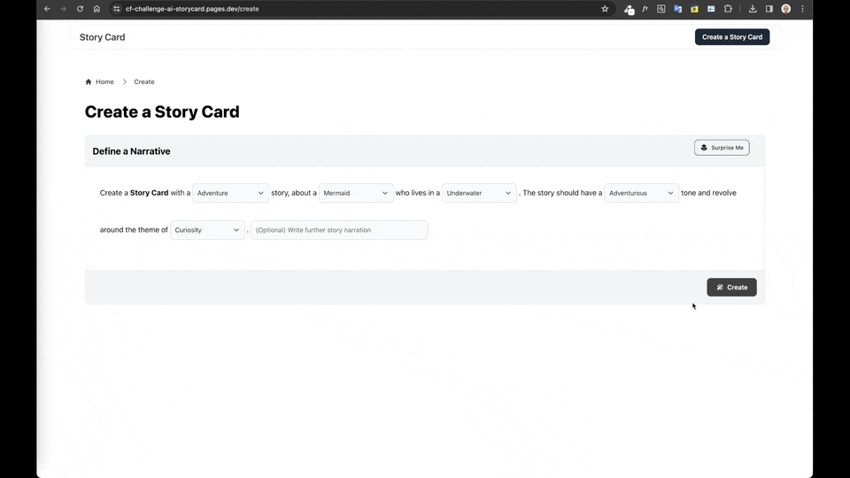
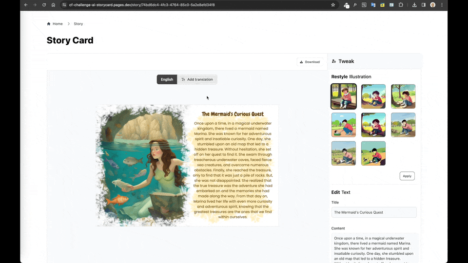
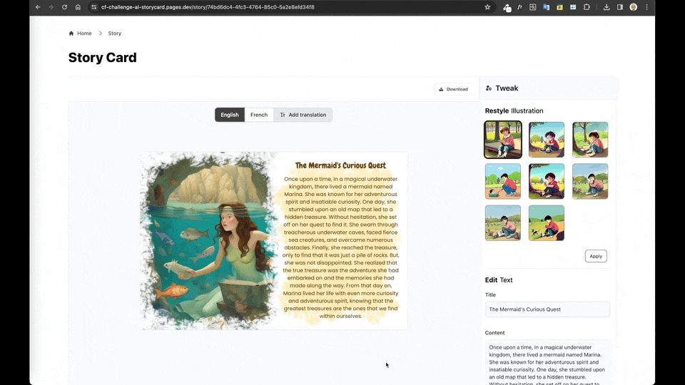
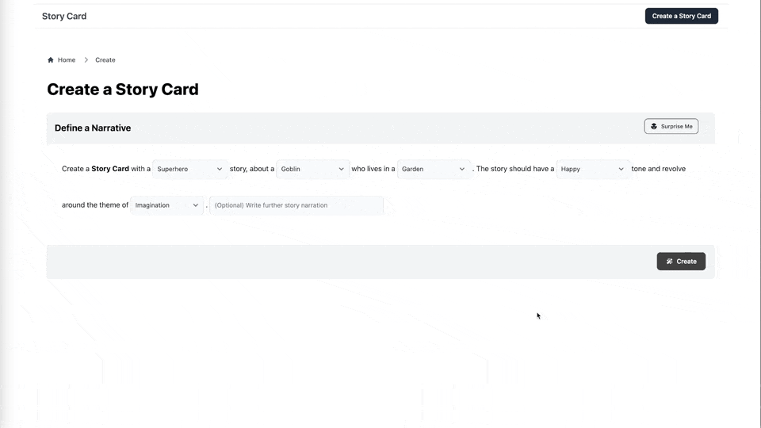
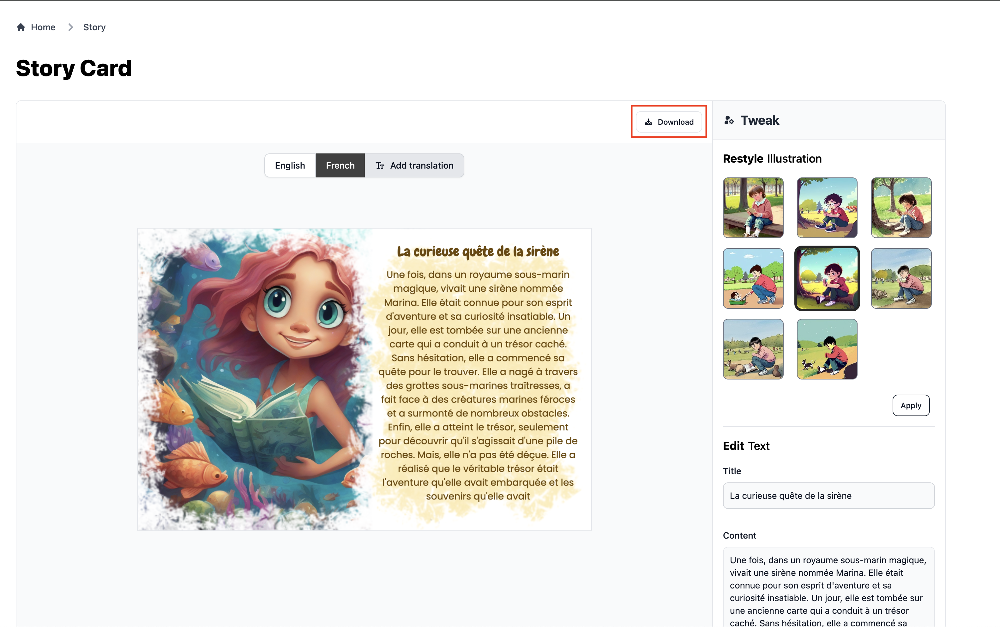
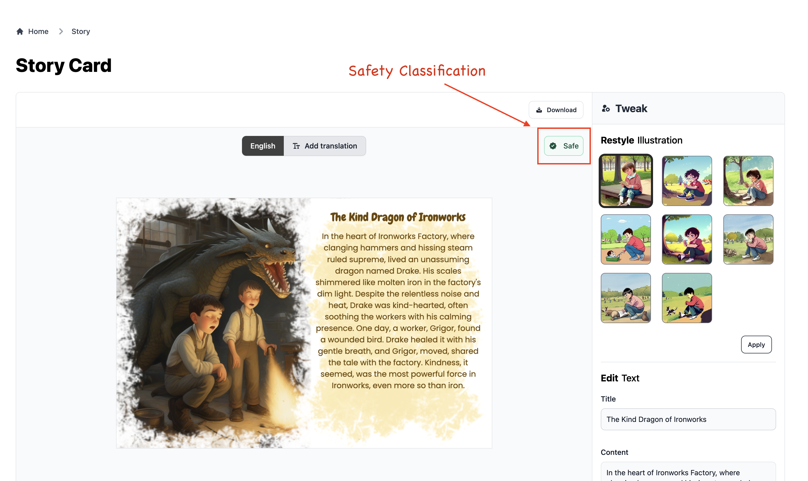

# AI Story Card ([#CloudflareAIDevChallenge](https://dev.to/challenges/cloudflare))

Create Stories in a card with illustrations using AI. Created as part of [Cloudflare AI Dev Challenge](https://dev.to/challenges/cloudflare).

**Demo** - https://cf-challenge-ai-storycard.pages.dev

## Features

1. **Create a Story Card**
   

2. **Translate the Story**
   

3. **Restyle the illustration**
   

4. **Surprise Me**
   

5. **Download Story Card**
   

6. **Safe for Kids**
   If any inappropriate content is detected, the story card will be marked as "unsafe" with a blurred preview image.
   

7. **Collaborate with friends**
   The url for a storycard is valid for a day. Comeback, edit and download it anytime within 24 hours.

## Cloudflare AI Models used:

1. **Text Generation** - [`mistral-7b-instruct-v0.2`](https://developers.cloudflare.com/workers-ai/models/mistral-7b-instruct-v0.2/)
2. **Image Generation** - [`stable-diffusion-xl-base-1.0`](https://developers.cloudflare.com/workers-ai/models/stable-diffusion-xl-base-1.0/)
3. **Translation** - [`m2m100-1.2b`](https://developers.cloudflare.com/workers-ai/models/m2m100-1.2b/)
4. **Image to Text** - [`uform-gen2-qwen-500m`](https://developers.cloudflare.com/workers-ai/models/uform-gen2-qwen-500m/)
5. **Text Content Moderation** - [`llamaguard-7b-awq`](https://developers.cloudflare.com/workers-ai/models/llamaguard-7b-awq/)

## Developing

Once you've created a project and installed dependencies with `npm install` (or `pnpm install` or `yarn`), start a development server:

```bash
npm run dev

# or start the server and open the app in a new browser tab
npm run dev -- --open
```

> **Note**
>
> The `AI` binding in Wrangler currently doesn't work while working locally

## Deploy

### Prerequisites

1. Create a Cloudflare account
2. Create an application under 'Workers & Pages'
3. Create a KV namespace
4. Create an R2 bucket
5. Update the [`wrangler.toml`](./wrangler.toml) file with right KV `id` and R2 `bucket_name`
6. Finally, login Wrangler into Cloudflare account by `npx wrangler login`

### Steps

1. Build the app

```bash
npm run build
```

2. Deploy the app

```bash
npm run deploy
```
